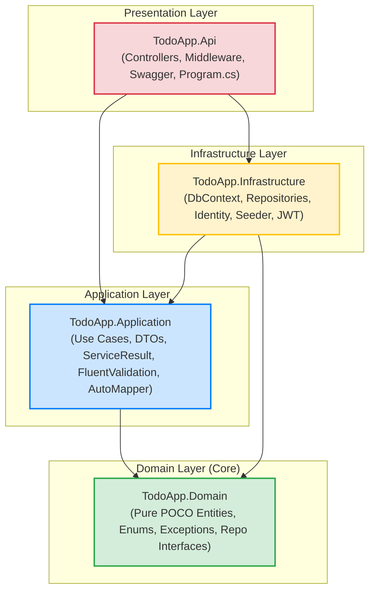
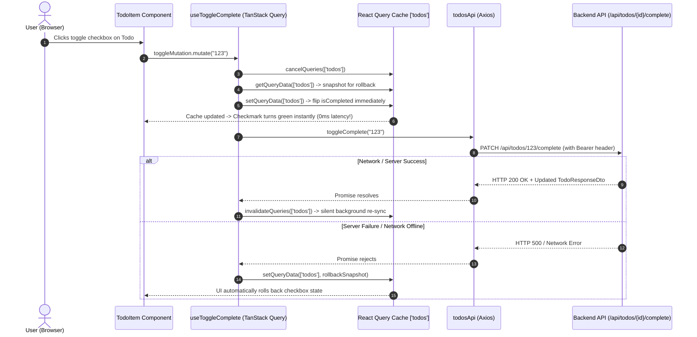

# 02 — Architectural Patterns & Layer Boundaries

This document defines the architectural patterns, module boundaries, dependency rules, and request execution flows governing both backend and frontend layers of TodoApp.

---

## 1. Architectural Patterns Overview

### 1.1 Backend: Clean / Layered Architecture (.NET 8)
The backend strictly adheres to **Clean Architecture** (also known as Onion or Hexagonal Architecture) governed by the **Inward Dependency Rule**:
* Outer layers depend on inner layers; inner layers never know about or depend on outer layers.
* Domain logic is fully decoupled from frameworks, databases, and network transports.
* Communication between application services and controllers uses the **Service Result Pattern** rather than throwing expensive runtime exceptions for ordinary business outcomes.



#### Layer Responsibilities & Constraints:
1. **`TodoApp.Domain`** (`backend/src/TodoApp.Domain/`):
   - **Core POCOs**: `TodoItem`, `BaseEntity`, `TodoPriority`.
   - **Interfaces**: `IGenericRepository<T>`, `ITodoRepository`.
   - **Exceptions**: `NotFoundException`, `ForbiddenException`, `ValidationAppException`.
   - **Constraint**: **Zero NuGet packages**. 100% pure C#. Cannot reference any other project.
2. **`TodoApp.Application`** (`backend/src/TodoApp.Application/`):
   - **Contracts & Models**: `ITodoService`, `IAuthService`, `IAdminUserService`, `IJwtTokenService`, `ServiceResult<T>`, `ServiceErrorType`, `Roles`.
   - **DTOs & Validators**: `CreateTodoRequestDto`, `TodoResponseDto`, `UpdateTodoRequestDto`, `LoginRequestDto`, `RegisterRequestDto`, `AuthResponseDto`, `UserSummaryDto`, `UpdateUserRoleRequestDto`.
   - **Constraint**: Depends only on `TodoApp.Domain` and lightweight abstraction packages (`AutoMapper`, `FluentValidation`, `Microsoft.Extensions.Identity.Stores`).
3. **`TodoApp.Infrastructure`** (`backend/src/TodoApp.Infrastructure/`):
   - **Persistence**: `ApplicationDbContext`, `TodoItemConfiguration`, `GenericRepository`, `TodoRepository`, EF Core migrations.
   - **Implementations**: `AuthService`, `AdminUserService`, `JwtTokenService`, `IdentitySeeder`.
   - **Constraint**: Implements application interfaces using concrete database technologies (EF Core SQLite, ASP.NET Core Identity).
4. **`TodoApp.Api`** (`backend/src/TodoApp.Api/`):
   - **Host & Transport**: ASP.NET Core Web API controllers (`TodosController`, `AuthController`, `AdminUsersController`), `ApiControllerBase`, `ExceptionHandlingMiddleware`, CORS configuration, Swagger OpenAPI docs, and DI composition root in `Program.cs`.

---

### 1.2 Frontend: Feature-Based (Screaming) Architecture (React 19 + TypeScript)
The frontend uses a **Feature-Based Architecture** where files are colocated by business domain rather than technical function:

```
src/
├── api/                   # Singleton Axios client with global JWT & 401 interceptors
├── components/            # Cross-cutting, domain-agnostic UI primitives and layout shells
│   ├── layout/            # AppLayout (navbar, footer, outlet), AuthLayout
│   └── ui/                # Button, Input, Card, Spinner, Toast, ConfirmDialog
├── features/              # Self-contained business domains
│   ├── auth/              # Types, pure API calls, useAuth hooks, LoginPage, RegisterPage
│   ├── todos/             # Types, API calls, useTodos (optimistic hooks), components, pages
│   └── admin/             # Types, API calls, useAdminUsers hooks, UserTable, AdminUsersPage
├── lib/                   # TanStack QueryClient singleton initialization
├── routes/                # Centralized router tree, ProtectedRoute RBAC guard, 404 page
├── stores/                # Global persistent auth session store (Zustand + persist)
└── types/                 # Domain DTO types mirroring backend contracts
```

---

## 2. Traced Request Lifecycles

### 2.1 Backend Representative Trace: `PATCH /api/todos/{id}/complete`
This trace demonstrates how an authenticated user toggles the completion status of a task:

```mermaid
sequenceDiagram
    autonumber
    actor Client as Frontend Client
    participant MW as ExceptionHandlingMiddleware
    participant Auth as JwtBearer Middleware
    participant Ctrl as TodosController
    participant Svc as TodoService
    participant Repo as TodoRepository
    participant DB as SQLite Database

    Client->>MW: PATCH /api/todos/e2b6.../complete (Bearer token)
    MW->>Auth: Invoke next()
    Auth->>Auth: Validate JWT signature, issuer, audience, and expiry
    Auth->>Ctrl: User claims populated (NameIdentifier, Role)
    Ctrl->>Svc: ToggleCompleteAsync(id, CurrentUserId, IsAdmin)
    Svc->>Repo: GetByIdAsync(id)
    Repo->>DB: SELECT * FROM TodoItems WHERE Id = @id
    DB-->>Repo: TodoItem record
    Repo-->>Svc: TodoItem entity
    Svc->>Svc: Ownership Check: (!isAdmin && item.OwnerId != userId)?
    alt Ownership Violation
        Svc-->>Ctrl: ServiceResult.Forbidden("Anda tidak memiliki akses...")
        Ctrl-->>Client: HTTP 403 Forbidden { error: "..." }
    else Valid Ownership
        Svc->>Svc: item.IsCompleted = !item.IsCompleted; item.UpdatedAt = UtcNow
        Svc->>Repo: Update(item)
        Svc->>Repo: SaveChangesAsync()
        Repo->>DB: UPDATE TodoItems SET IsCompleted = @val, UpdatedAt = @time WHERE Id = @id
        DB-->>Repo: 1 row updated
        Svc->>Svc: AutoMapper: Map TodoItem -> TodoResponseDto
        Svc-->>Ctrl: ServiceResult<TodoResponseDto>.Success(dto)
        Ctrl-->>Client: HTTP 200 OK (TodoResponseDto JSON)
    end
```

### 2.2 Frontend Representative Trace: Optimistic Todo Completion Toggle
This trace illustrates zero-latency client state mutation with background synchronization:



---

## 3. Module & Boundary Analysis

### 3.1 Hard Seams (Architectural Boundaries)
* **API $\rightarrow$ Application**: Controllers never access `ApplicationDbContext` or `ITodoRepository` directly; all interactions occur through `ITodoService`, `IAuthService`, and `IAdminUserService`.
* **Application $\rightarrow$ Domain**: Application orchestrates domain entities and repository contracts without polluting the Domain layer with web or database frameworks.
* **Frontend State Segregation**:
  - **Server State**: Managed strictly by TanStack Query (`['todos']`, `['admin-users']`).
  - **Client UI Filter State**: Managed strictly by Zustand (`useTodoUiStore`).
  - **Persistent Session State**: Managed strictly by Zustand with `persist` (`useAuthStore`).

### 3.2 Shared Fate File Groups (Change Hotspots)
Files that inherently change together when modifying features:
1. **Todo Entity Evolution**:
   - `TodoApp.Domain/Entities/TodoItem.cs`
   - `TodoApp.Infrastructure/Persistence/Configurations/TodoItemConfiguration.cs`
   - `TodoApp.Application/Features/Todos/Dtos/CreateTodoRequestDto.cs` & `TodoResponseDto.cs`
   - `frontend/src/types/todo.ts`
2. **User Role or Lockout Logic**:
   - `TodoApp.Application/Features/Admin/IAdminUserService.cs`
   - `TodoApp.Infrastructure/Services/AdminUserService.cs`
   - `TodoApp.Api/Controllers/AdminUsersController.cs`
   - `frontend/src/features/admin/components/UserTable.tsx`
   - `frontend/src/features/admin/hooks/useAdminUsers.ts`

