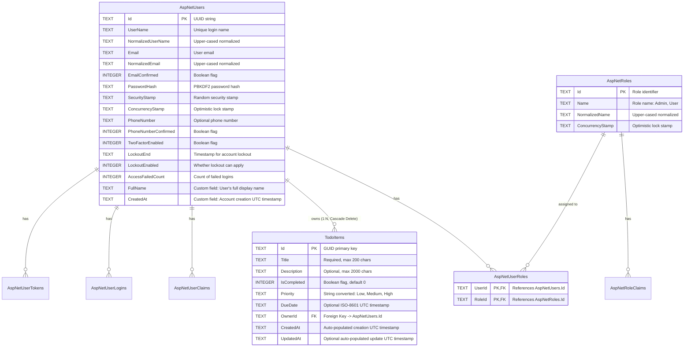

# 04 — Data Model & Schema Specification

This document details the database schema, entity structures, relationships, column types, constraints, cascade rules, and audit lifecycle mechanisms implemented via **Entity Framework Core 8** on **SQLite**.

---

## 1. Entity-Relationship Diagram (Mermaid)



---

## 2. Table Specifications

### 2.1 Table: `TodoItems`
Configured in `backend/src/TodoApp.Infrastructure/Persistence/Configurations/TodoItemConfiguration.cs` and entity class `backend/src/TodoApp.Domain/Entities/TodoItem.cs`.

| Column Name | .NET Type | SQLite Type | Nullable | Constraints & Defaults | Description |
|---|---|---|---|---|---|
| **`Id`** | `Guid` | `TEXT` | **NO** | `PRIMARY KEY` | Unique identifier generated on creation (`Guid.NewGuid()`). |
| **`Title`** | `string` | `TEXT` | **NO** | `HasMaxLength(200)` | Task title; required by FluentValidation and EF configuration. |
| **`Description`** | `string?` | `TEXT` | **YES** | `HasMaxLength(2000)` | Optional detailed task notes. |
| **`IsCompleted`** | `bool` | `INTEGER` | **NO** | Default: `0` (`false`) | Task completion status. |
| **`Priority`** | `TodoPriority` | `TEXT` | **NO** | Enum converted to string (`Low`, `Medium`, `High`), max 20 | Task urgency level. |
| **`DueDate`** | `DateTime?` | `TEXT` | **YES** | ISO-8601 string in UTC | Optional deadline for task completion. |
| **`OwnerId`** | `string` | `TEXT` | **NO** | `INDEX`, `FOREIGN KEY` | ID of the user who owns this task (`AspNetUsers.Id`). |
| **`CreatedAt`** | `DateTime` | `TEXT` | **NO** | Auto-set by `ApplicationDbContext` | UTC timestamp when record was created. |
| **`UpdatedAt`** | `DateTime?` | `TEXT` | **YES** | Auto-set by `ApplicationDbContext` | UTC timestamp when record was last modified. |

#### Indices & Keys:
- **Primary Key**: `PK_TodoItems` on column `Id`.
- **Foreign Key**: `FK_TodoItems_AspNetUsers_OwnerId` references `AspNetUsers(Id)` with `ON DELETE CASCADE`.
- **Index**: `IX_TodoItems_OwnerId` on column `OwnerId` to ensure fast user-scoped query filtering (`GetByOwnerIdAsync`).

---

### 2.2 Table: `AspNetUsers`
Inherits from ASP.NET Core Identity's `IdentityUser` with extensions defined in `backend/src/TodoApp.Application/Identity/ApplicationUser.cs`.

| Column Name | .NET Type | SQLite Type | Nullable | Notes |
|---|---|---|---|---|
| **`Id`** | `string` | `TEXT` | **NO** | `PRIMARY KEY` (string GUID representation). |
| **`UserName`** | `string?` | `TEXT` | **YES** | Set to user's email address during registration. |
| **`NormalizedUserName`** | `string?` | `TEXT` | **YES** | Upper-case email for case-insensitive lookup. |
| **`Email`** | `string?` | `TEXT` | **YES** | User's unique email address. |
| **`NormalizedEmail`** | `string?` | `TEXT` | **YES** | Upper-case email for case-insensitive lookup. |
| **`EmailConfirmed`** | `bool` | `INTEGER` | **NO** | Set to `1` (true) for seeded demo accounts. |
| **`PasswordHash`** | `string?` | `TEXT` | **YES** | PBKDF2 hash with HMAC-SHA256 and unique salt. |
| **`SecurityStamp`** | `string?` | `TEXT` | **YES** | Changes whenever user credentials change. |
| **`ConcurrencyStamp`** | `string?` | `TEXT` | **YES** | Optimistic concurrency token. |
| **`PhoneNumber`** | `string?` | `TEXT` | **YES** | Unused in this application. |
| **`PhoneNumberConfirmed`**| `bool` | `INTEGER` | **NO** | Unused in this application. |
| **`TwoFactorEnabled`** | `bool` | `INTEGER` | **NO** | Unused in this application. |
| **`LockoutEnd`** | `DateTimeOffset?`| `TEXT` | **YES** | If set to a future timestamp, user login is blocked. |
| **`LockoutEnabled`** | `bool` | `INTEGER` | **NO** | Set to `1` when lockout toggle is applied. |
| **`AccessFailedCount`** | `int` | `INTEGER` | **NO** | Tracks consecutive invalid password attempts. |
| **`FullName`** | `string` | `TEXT` | **NO** | **Custom Field**: User's display name. |
| **`CreatedAt`** | `DateTime` | `TEXT` | **NO** | **Custom Field**: UTC timestamp of account creation. |

---

### 2.3 ASP.NET Core Identity Supporting Tables

1. **`AspNetRoles`**:
   - `Id` (`TEXT`, PK), `Name` (`TEXT`), `NormalizedName` (`TEXT`), `ConcurrencyStamp` (`TEXT`).
   - Default seeded rows: `"Admin"`, `"User"`.
2. **`AspNetUserRoles`**:
   - `UserId` (`TEXT`, PK, FK $\rightarrow$ `AspNetUsers.Id`), `RoleId` (`TEXT`, PK, FK $\rightarrow$ `AspNetRoles.Id`).
   - Composite Primary Key: `(UserId, RoleId)`.
3. **`AspNetUserClaims`**, **`AspNetUserLogins`**, **`AspNetUserTokens`**, **`AspNetRoleClaims`**:
   - Standard Identity framework tables for federated logins, custom user/role claims, and security tokens.

---

## 3. Database Lifecycle & Audit Mechanisms

### 3.1 Automated Timestamp Auditing
Implemented in `backend/src/TodoApp.Infrastructure/Persistence/ApplicationDbContext.cs`:
```csharp
public override Task<int> SaveChangesAsync(CancellationToken cancellationToken = default)
{
    var entries = ChangeTracker.Entries<BaseEntity>();
    var now = DateTime.UtcNow;

    foreach (var entry in entries)
    {
        if (entry.State == EntityState.Added)
        {
            if (entry.Entity.CreatedAt == default)
            {
                entry.Entity.CreatedAt = now;
            }
        }
        else if (entry.State == EntityState.Modified)
        {
            entry.Entity.UpdatedAt = now;
        }
    }

    return base.SaveChangesAsync(cancellationToken);
}
```
* **Benefit**: Application services do not need to manually set `CreatedAt` or remember to update `UpdatedAt` timestamps. The change tracker intercepts state changes before SQL generation.

### 3.2 Cascade Deletion
* Configured on `TodoItemConfiguration`:
  ```csharp
  builder.HasOne<ApplicationUser>()
      .WithMany()
      .HasForeignKey(t => t.OwnerId)
      .OnDelete(DeleteBehavior.Cascade);
  ```
* **Behavior**: If an Administrator deletes a user account via `DELETE /api/admin/users/{id}`, SQLite / EF Core automatically cascades the deletion, removing all `TodoItems` belonging to that user.

### 3.3 Concurrency & Soft-Delete Analysis
* **Concurrency**: Handled on identity records via `ConcurrencyStamp`.
* **Soft-Delete**: Not implemented; TodoApp currently performs hard deletes for tasks and user records to keep the demonstration architecture clean and transparent.

