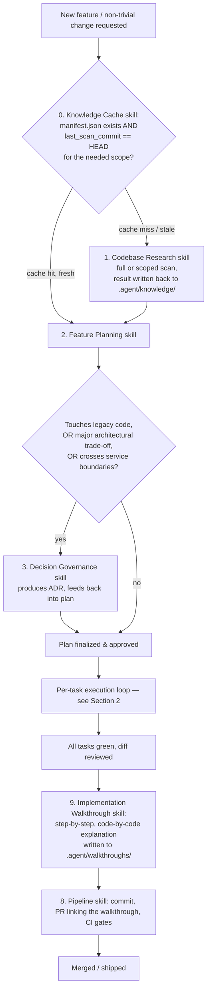
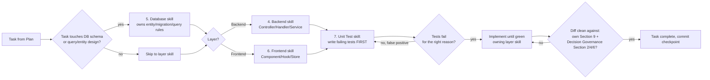

# Full-Stack Agent Orchestration Workflow

This document governs **which skill to invoke, in what order, and under what conditions** across a full feature-development cycle. It exists because the individual skills each own a slice of the process but do not automatically know about each other — this is the missing glue layer.

> **Skill roster** — one line each, so the orchestration below can be read without re-opening every SKILL.md:

| # | Skill | Phase it owns | Primary output |
|---|---|---|---|
| 0 | Codebase Knowledge Cache & Persistence Governance | Pre-Research gate | Cache hit/miss decision, `.agent/knowledge/*` |
| 1 | Codebase Research & Architecture Mapping | Research (on cache miss only) | `codebase-map.md` + `deep-dive/*.md` |
| 2 | Feature Development Planning | Plan | `plan.md` |
| 3 | Architecture, Technical Debt & Decision Governance | Plan (conditional) | ADR block, refactor-scope advisories |
| 4 | .NET 8 Backend API & Enterprise Logic | Implement (backend) | Controllers/Handlers/Services |
| 5 | EF Core 8 & SQL Server Database | Implement (data layer) | Entities, Configurations, Migrations |
| 6 | React & TypeScript UI/State Engineering | Implement (frontend) | Components/Hooks/Stores |
| 7 | Quality Gate & Automated Test Engineering | Test (cross-cutting) | Unit/Integration/Component tests |
| 8 | DevOps, Git Governance & CI/CD Pipeline | Ship | Commits, PR, pipeline config |
| 9 | Implementation Walkthrough & Developer Learning Documentation | Document (post-review, pre-ship) | `.agent/walkthroughs/<feature>-<date>.md` |

---

## 1. Master Flow

**Gate rule**: do not proceed past a node until that node's owning skill has produced its artifact. Skipping straight from "feature requested" to writing code is the failure mode this whole document exists to prevent. **Two gates are non-optional by design**: the Knowledge Cache gate (#0) — no skill triggers Codebase Research directly — and the Walkthrough gate (#9) — no PR reaches the Pipeline skill without a linked step-by-step explanation, for anything that was significant enough to warrant a plan in the first place.

---

## 2. Per-Task Execution Loop (runs once per task in the Plan's Task Breakdown)

Each task from the Plan's `## Task Breakdown` (Planning skill, Section 6) goes through this micro-loop before being marked done:

**Key points**:
* The Unit Test skill (#7) is the single source of truth for *how* tests are written (naming convention, AAA structure, mocking rules, Testcontainers/MSW setup) regardless of whether the task is backend or frontend. The Backend/Frontend skills' own "Test First" sub-sections (their Section 10.3) are pointers, not a competing test-writing standard.
* If a task's implementation reveals the codebase has changed in a way the cached research didn't anticipate (e.g. a file/module that no longer exists as documented), route back through the **Knowledge Cache** skill for a scoped refresh of that area before continuing — don't let the layer skill quietly work around stale documentation.
* This per-task loop covers Research through Review only. **The Walkthrough step (#9) runs once, at the feature level, after every task in the plan has cleared this loop** — see Section 3 below. Do not generate a per-task walkthrough fragment; the value is in one coherent narrative across the whole feature.

---

## 3. Phase-by-Phase Detail

### Phase -1 — Knowledge Cache Gate (runs before every other phase, every task)
* **Invoke**: Codebase Knowledge Cache skill.
* **What it does**: checks `.agent/knowledge/manifest.json` against the current HEAD commit and the scope the upcoming task needs (per its own Section 5 freshness protocol), and returns one of:
  * A fresh cached knowledge base → skip Phase 0 entirely.
  * A stale-but-patchable cache → triggers Codebase Research in **scoped update mode** (only the affected deep-dive file(s) get refreshed).
  * No valid cache → triggers Codebase Research for a **full comprehensive scan**, then persists the result.
* **Why this phase exists**: without it, every task that mentions "explore/understand the codebase" re-triggers a full scan, even on a repo that was already thoroughly mapped an hour ago. This phase is what makes Phase 0 conditional instead of habitual.
* Exit criteria: you hold the relevant knowledge-base file(s) — from cache or freshly produced — before Phase 0/1 is considered started.

### Phase 0 — Research (only runs on a cache miss or stale scope, per Phase -1)
* **Invoke**: Codebase Research skill — but only because Phase -1 said to. Never invoke this skill directly from Planning or an execution skill.
* **Output feeds into**: Planning skill's Section 3 (Discovery) and Section 5 (Technical Design) directly — the plan should cite specific findings from the knowledge base, not re-derive them.
* **Output must be persisted**: written to `.agent/knowledge/codebase-map.md` and the relevant `deep-dive/*.md` file(s) via the Knowledge Cache skill's Section 4/8, so the next task's Phase -1 check gets a hit instead of repeating this phase.

### Phase 1 — Plan
* **Invoke**: Feature Planning skill.
* **Input**: the feature request + the knowledge base (from Phase -1/0, cached or fresh).
* **Decision point**: while drafting Section 5 (Technical Design) and Section 8 (Risk Assessment), check:
  * Does this touch code flagged as legacy, high-complexity, or "don't touch" in the Technical Debt Register (`11-technical-debt-register.md`)? → **invoke Decision Governance skill**, get an ADR, attach it under Technical Design.
  * Does this involve a monolith-vs-microservice, sync-vs-async, or similar foundational trade-off? → same trigger.
  * Does any task involve a schema change? → tag that task explicitly as "subject to Database skill's Migration Safety rules (Section 2)" so it isn't planned as a single-step destructive migration.
* **Output**: an approved `plan.md` per the Planning skill's Section 11 template, with an optional `## Architectural Decision` sub-section under Technical Design when Decision Governance was invoked.
* **Gate**: do not proceed to Phase 2 without explicit approval for anything touching production data, billing, auth, or a public API contract (Planning skill Section 12).

### Phase 2 — Implement (per task, looped per Section 2 above)
* **Backend tasks** → Backend skill owns Controller/Handler/Service/DTO code and defers all EF Core/entity/migration/query specifics to the **Database skill** — do not let the Backend skill's own Section 5 be treated as the final word on data-access rules; Database skill's Sections 2–7 are the authority (migration safety, indexing, concurrency, global filters).
* **Frontend tasks** → Frontend skill owns Component/Hook/Store/API-integration code per its own Sections 2–8.
* **Every task, regardless of layer** → before implementation, the Unit Test skill's Sections 3–6 (backend) or Section 5 (frontend) govern what tests get written and how, following the Plan's Section 7 (Test Strategy) for *what* to test — the Unit Test skill governs *how*.
* **Ordering within a task**: Test skill writes failing tests → owning layer skill (Backend/Frontend/Database) implements until green. Never reverse this order (see each execution skill's rationale section for why).

### Phase 3 — Review & Harden (after all tasks in the plan are green)
* Check the full diff against:
  1. The owning layer skill's own Negative Constraints (Backend Section 9 / Frontend Section 9 / Database Section 8).
  2. **Decision Governance skill's Sections 2, 4, 6** — no rogue refactoring outside scope, no static mutable state introduced, complexity/cognitive-load bounds respected, Law of Demeter respected.
  3. The Plan's Section 10 (Definition of Done) — every acceptance criterion checkable and met.
* If a repeated failure loop happens here (2–3 cycles fixing the same class of issue), stop and return to **Phase 1** — re-plan, per the Planning skill's re-plan trigger, rather than continuing to patch.

### Phase 3.5 — Document (new: runs once, at the feature level, after Phase 3 passes)
* **Invoke**: Implementation Walkthrough skill.
* **Input**: the approved `plan.md` (for structure and ordering), the final diff across every task/layer touched, the test files the Unit Test skill produced, and any ADR from Decision Governance.
* **What it produces**: a single `.agent/walkthroughs/<feature-slug>-<date>.md` document that walks through every task from the plan, in implementation order, pairing real code snippets with plain-language explanations, the specific owning-skill rule each choice followed, the tests that verify it, and any point where implementation diverged from the original plan.
* **Why this phase exists**: this is the artifact that lets a developer *learn* from what the agent did, not just review whether it's correct. Review (Phase 3) answers "is this right?"; this phase answers "why is it right, and what should I take away from it?" — a different question, worth a separate, dedicated pass.
* **Skip condition**: only skip this phase if Phase 1 (Planning) itself did not trigger for this change (i.e. it was a one-line fix/typo/config value with no plan at all). If a plan existed, a walkthrough is produced — no exceptions for "it felt small."
* **Gate**: the Pipeline skill's Ship step (Phase 4) will not consider a PR complete without this document linked in the PR description.

### Phase 4 — Ship
* **Invoke**: Pipeline skill for everything from this point on — branch naming, Conventional Commits format, PR template (now including a **How It Works — Step by Step** section linking Phase 3.5's document), and CI/CD gate structure. The layer skills' own "Ship" sub-sections should defer entirely to this skill rather than restating commit/PR conventions.
* **Gate**: PR must carry test evidence (Pipeline Section 4), the linked walkthrough document, pass all CI stages (lint → security scan → build → test → package — Pipeline Section 5), and reference the approved plan in its description.
* Any schema migration ships as an idempotent script per Database skill's Section 2 production deployment rules — never `Database.Migrate()` on boot.
* If this feature's changes are significant enough that the repo's shape materially changed (new subsystem, new top-level module), flag it so the **Knowledge Cache** skill's `manifest.json` gets updated post-merge — otherwise the next task's Phase -1 check will detect drift and trigger a re-scan anyway, which is fine, but doing it proactively keeps the cache honest sooner.

---

## 4. Conditional Skill Triggers — Quick Reference

| Situation encountered mid-workflow | Skill to invoke |
|---|---|
| Any task that would otherwise trigger "explore the codebase" | Codebase Knowledge Cache (always first — it decides if Research even runs) |
| Knowledge Cache reports a miss or stale scope | Codebase Research (full comprehensive scan, or scoped to specific deep-dive files) |
| Any feature request with 3+ files affected or an architectural choice | Feature Planning |
| Plan touches legacy code, a foundational trade-off, or crosses service boundaries | Decision Governance |
| A task adds/changes an entity, migration, index, or query | Database |
| A task adds/changes a Controller, Handler, Service, or API contract | Backend |
| A task adds/changes a Component, Hook, Store, or client API call | Frontend |
| Any task, immediately before implementation | Quality Gate & Automated Test |
| A high-complexity method or legacy hotspot is encountered outside current task scope | Decision Governance (flag only — do not fix silently) |
| All tasks in a planned feature have passed Review & Harden | Implementation Walkthrough (once, at the feature level) |
| Any commit, branch, PR, or pipeline failure | DevOps/Git/CI/CD Pipeline |
| Implementation fails 2–3 times against the same plan | Back to Feature Planning (re-plan, don't re-patch) |
| A file/module referenced by the cached knowledge base no longer matches reality mid-task | Back to Knowledge Cache for a scoped refresh, before continuing the task |
| User explicitly asks to "re-scan"/"re-map"/"refresh" the codebase understanding | Knowledge Cache → forces full comprehensive Codebase Research regardless of cache state |

---

## 5. Worked Example — "Add order refund with partial-amount support"

1. **Knowledge Cache check**: `.agent/knowledge/manifest.json` exists, `last_full_scan_commit` is 3 commits behind HEAD, and `git diff --stat` shows those 3 commits only touched an unrelated `notifications` module → the `04-data-model.md` and `05-api-contracts.md` deep-dive files are still valid for the `payments`/`orders` scope. **No scan runs.** The cached files are handed straight to Planning.
2. **Plan**: Feature Planning skill drafts `plan.md` from the cached knowledge base. While writing Technical Design, notices `PaymentService` is listed in `11-technical-debt-register.md` as a churn hotspot, and this feature touches money → **invokes Decision Governance**, which produces an ADR choosing "extend existing service with a `Refund` method behind a feature flag" over "new RefundService" (rejected: unnecessary complexity for current volume). ADR is attached to the plan. A task in the breakdown is tagged "schema change — Database skill Expand/Contract applies" for the new `RefundAmount` column.
3. **Implement, task by task**:
   - Task: add `RefundAmount` + `RefundedAt` nullable columns → **Database skill** (additive migration, single step per its Section 2 low-impact rule).
   - Task: `POST /orders/{id}/refund` endpoint → **Unit Test skill** writes failing handler tests (happy path + insufficient-balance edge case) → **Backend skill** implements until green, using idempotency-key handling per its Section 7.
   - Task: refund button + confirmation modal → **Unit Test skill** writes failing RTL tests (including the loading/error states) → **Frontend skill** implements until green, using MSW-mocked API per its Section 10.3.
4. **Review**: diff checked against Backend/Frontend Section 9, Database Section 8, and Decision Governance Sections 2/4/6 (confirms no rogue refactor of unrelated `PaymentService` code beyond the planned `Refund` method).
5. **Document**: **Implementation Walkthrough skill** produces `.agent/walkthroughs/order-partial-refund-2026-09-15.md` — three steps mirroring the Task Breakdown above, each showing the real migration/handler/component code alongside its tests, explaining e.g. *"the migration is additive-only per the Database skill's Expand & Contract rule, because `RefundAmount` defaults to null for existing orders"* and *"the endpoint returns `Result<T>` rather than throwing on insufficient balance, per the Backend skill's Section 8, because this is an expected business outcome, not a crash."* Closes with Key Takeaways on idempotency-key handling and the ADR's reasoning for extending vs. creating a new service.
6. **Ship**: **Pipeline skill** — branch `feature/order-partial-refund`, Conventional Commits (`feat(order): add partial refund endpoint`), PR using the standard template with test evidence **and the walkthrough document** linked, CI runs lint → security scan → build → test → package before merge. Since this added a genuinely new capability (`Refund`) to an existing aggregate rather than a new subsystem, the Knowledge Cache's manifest is patched incrementally (new commit hash, `payments`-related deep-dive files updated) rather than triggering a full re-scan.

---

## 6. Anti-Patterns in Orchestration
* ❌ **Invoking Codebase Research directly**, bypassing the Knowledge Cache gate — this is exactly the repeated-full-scan problem the cache skill exists to prevent.
* ❌ **Jumping straight to a layer skill** (Backend/Frontend/Database) without an approved plan for anything beyond a one-line fix.
* ❌ **Letting a layer skill's embedded "Test First" note substitute for actually invoking the Unit Test skill** — it's a pointer, not a replacement standard.
* ❌ **Silently fixing a flagged hotspot** encountered mid-task instead of routing it through Decision Governance's advisory flag.
* ❌ **Writing commit messages or PR descriptions from a layer skill's own judgment** instead of the Pipeline skill's format — causes inconsistent history.
* ❌ **Re-running the same fix 4+ times** instead of triggering the re-plan path back to Feature Planning after 2–3 failures.
* ❌ **Treating a stale cache as good enough** because re-scanning feels expensive — the Knowledge Cache skill's own freshness/staleness rules exist precisely to make that trade-off correctly instead of by default.
* ❌ **Full-scanning when a scoped update would do** — if only one subsystem changed, only that subsystem's deep-dive file(s) should be refreshed.
* ❌ **Shipping without a walkthrough** on anything that went through Feature Planning — the Pipeline skill's checklist should catch this, but it should never reach that gate in the first place if Phase 3.5 was skipped.
* ❌ **Writing the walkthrough before the diff is final** — producing it mid-implementation guarantees it goes stale before anyone reads it; it belongs strictly after Phase 3 passes.
* ❌ **Generating a walkthrough per task instead of per feature** — fragments defeat the purpose; a developer should be able to read one coherent document covering the whole feature start to finish.